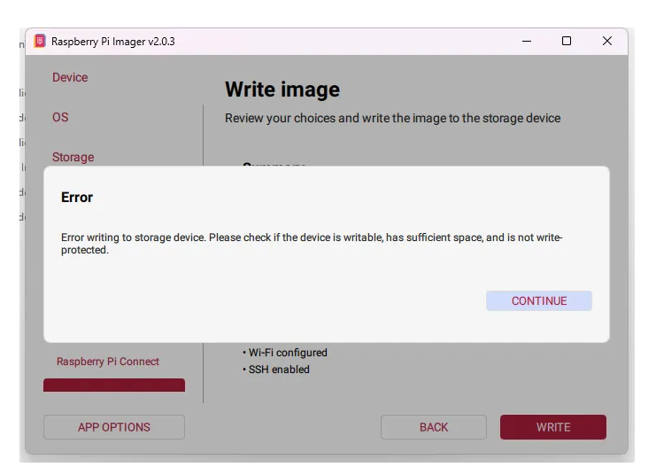
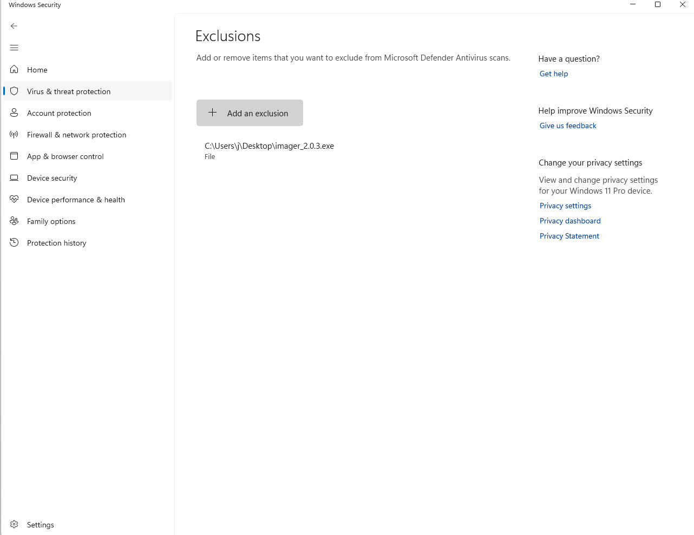
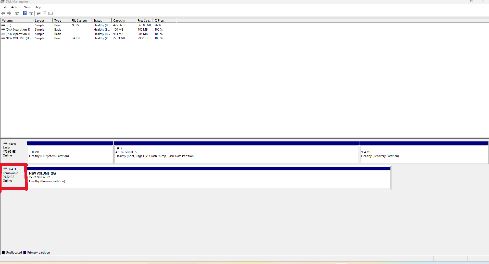
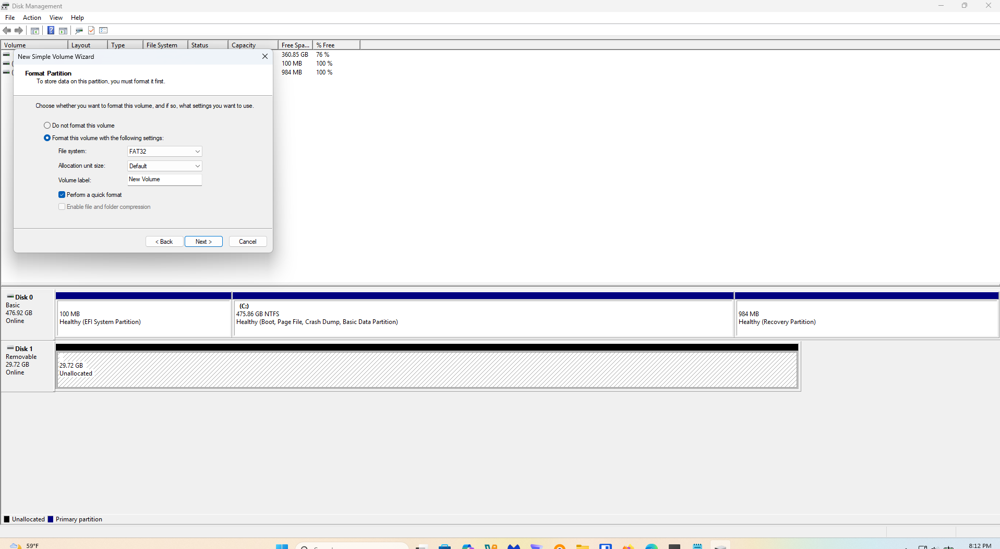

# Raspberry Pi 4 – OS Installation & Windows Troubleshooting Guide

A practical guide to installing Raspberry Pi OS on a Pi 4, with fixes for common Windows 11 issues such as Windows Defender blocking the imaging process and SD cards becoming unallocated.

Raspberry Pi 4: OS Installation & Windows Troubleshooting Guide

## Overview

Setting up a Raspberry Pi 4 is usually straightforward, but Windows 11 security features can interfere with the Raspberry Pi Imager. This often results in write errors or SD cards that appear to “disappear” after a failed flash.

This guide covers:
- Installing Raspberry Pi OS
- Resolving Windows Defender conflicts
- Recovering SD cards using Disk Management

## Prerequisites

### Hardware
- Raspberry Pi 4  
- Micro SD card (32 GB or larger)  
- SD card reader

 ### Software
- Raspberry Pi Imager  
- Windows 11 PC

## Installation & Troubleshooting Walkthrough

### 1. Initial Setup & Common Error ⚠️
When flashing Raspberry Pi OS, you may encounter a **Write Error**.  
This typically happens when Windows Defender blocks disk write access.

### 2. Resolving Windows Defender Blocks 🛡️

#### Disable Controlled Folder Access
1. Open **Windows Security**
2. Go to **Virus & threat protection**
3. Select **Ransomware protection**
4. Toggle **Controlled folder access** to **Off**

[[

#### Add Raspberry Pi Imager as an Exclusion
Add the file path for the Raspberry Pi imager to the exclusions list. 

### 3. Recovering a “Missing” SD Card 💾
A failed flash can leave the SD card marked as **Unallocated**, making it invisible in File Explorer.

#### Fix via Disk Management
1. Open **Disk Management**
2. Locate the unallocated SD card
3. Right-click and select **New Simple Volume**
4. Assign a drive letter
5. Format as **FAT32**

The SD card should now reappear in File Explorer.

### 4. Final Verification ✅
With Windows Defender exclusions set and the SD card properly partitioned, re-run the Raspberry Pi Imager. The installation should complete successfully, allowing the Pi to boot into Raspberry Pi OS.

